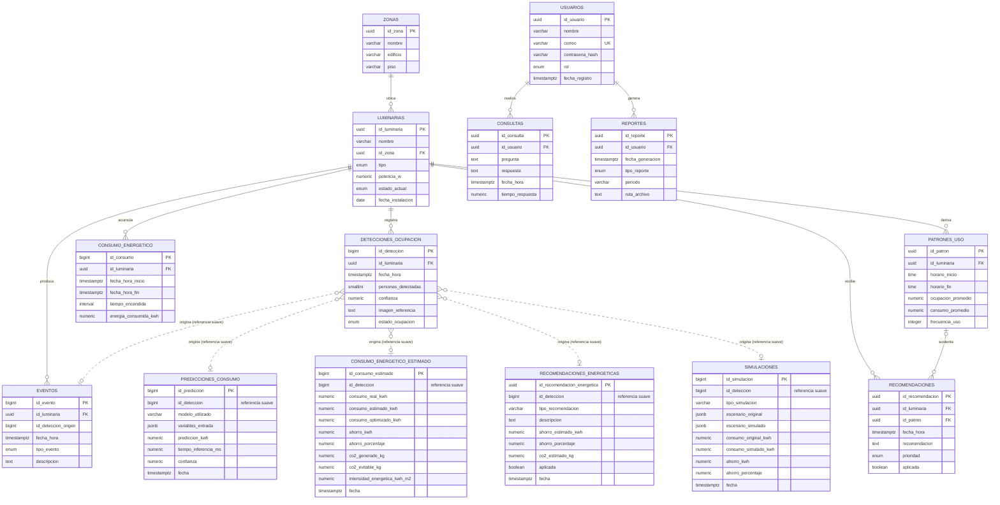

# Diseño de base de datos — Sistema Inteligente Autónomo de Gestión de Luminarias

Base de datos relacional en **PostgreSQL**, normalizada hasta **3FN**, pensada para
recibir escritura de alta frecuencia desde el pipeline de visión por computador
(`ModeloDeteccionLamp_App`) y para ser consumida por un backend **FastAPI**.

Script ejecutable completo: [`schema.sql`](schema.sql).

## Requisito específico: hora de cada detección de persona

`detecciones_ocupacion.fecha_hora` (`TIMESTAMPTZ NOT NULL DEFAULT now()`) guarda el
instante exacto de **cada** detección. Cada evaluación de frame/intervalo del
pipeline inserta una **fila nueva** — nunca se actualiza una fila existente — por lo
que queda un historial completo de "cuándo se detectó una persona" por luminaria,
consultable con `ORDER BY fecha_hora`. Un `CHECK` (`chk_deteccion_consistencia`)
obliga a que `estado_ocupacion = 'ocupado'` implique `personas_detectadas >= 1`, y
`'vacio'` implique `personas_detectadas = 0`, así el dato nunca queda inconsistente.

---

## 1. Modelo entidad-relación (ERD)

---

## 2. Especificación de tablas

### `zonas` (tabla catálogo, añadida para cumplir 3FN)

El enunciado pide `zona` como atributo de texto en `Luminarias`. Se normalizó en una
tabla catálogo `zonas` porque una zona tiene atributos propios (`edificio`, `piso`,
`descripcion`) que, si vivieran repetidos como texto libre en cada fila de
`luminarias`, generarían redundancia y anomalías de actualización (dependencia
transitiva) — justo lo que 3FN prohíbe. `luminarias.id_zona` es el equivalente
funcional al atributo `zona` solicitado.

| Atributo | Tipo | Restricciones | Default |
|---|---|---|---|
| id_zona | UUID | PK | `gen_random_uuid()` |
| nombre | VARCHAR(100) | NOT NULL, UNIQUE | — |
| edificio | VARCHAR(100) | — | — |
| piso | VARCHAR(50) | — | — |
| descripcion | TEXT | — | — |
| created_at | TIMESTAMPTZ | NOT NULL | `now()` |

### `usuarios`

| Atributo | Tipo | Restricciones | Default |
|---|---|---|---|
| id_usuario | UUID | PK | `gen_random_uuid()` |
| nombre | VARCHAR(150) | NOT NULL | — |
| correo | VARCHAR(255) | NOT NULL, UNIQUE, CHECK formato email | — |
| contrasena_hash | VARCHAR(255) | NOT NULL | — |
| rol | ENUM `rol_usuario_enum` | NOT NULL | `'visor'` |
| activo | BOOLEAN | NOT NULL | `TRUE` |
| fecha_registro | TIMESTAMPTZ | NOT NULL | `now()` |
| updated_at | TIMESTAMPTZ | NOT NULL (trigger) | `now()` |

`contrasena_hash` almacena solo el hash (bcrypt/argon2); el hashing ocurre en FastAPI,
nunca en la base de datos.

**Relaciones:** 1:N con `consultas`, 1:N con `reportes`.

### `luminarias`

| Atributo | Tipo | Restricciones | Default |
|---|---|---|---|
| id_luminaria | UUID | PK | `gen_random_uuid()` |
| nombre | VARCHAR(150) | NOT NULL | — |
| id_zona | UUID | NOT NULL, FK → `zonas` | — |
| tipo | ENUM `tipo_luminaria_enum` | NOT NULL | — |
| potencia_w | NUMERIC(6,2) | NOT NULL, CHECK > 0 | — |
| estado_actual | ENUM `estado_luminaria_enum` | NOT NULL | `'apagada'` |
| fecha_instalacion | DATE | NOT NULL | `CURRENT_DATE` |
| activa | BOOLEAN | NOT NULL | `TRUE` |
| created_at / updated_at | TIMESTAMPTZ | NOT NULL (trigger en updated_at) | `now()` |

UNIQUE(`nombre`, `id_zona`) evita luminarias duplicadas dentro de la misma zona.

**Relaciones:** N:1 con `zonas`; 1:N con `detecciones_ocupacion`, `eventos`,
`consumo_energetico`, `patrones_uso`, `recomendaciones`.

### `detecciones_ocupacion`

| Atributo | Tipo | Restricciones | Default |
|---|---|---|---|
| id_deteccion | BIGINT IDENTITY | PK (compuesta con fecha_hora) | autogenerado |
| id_luminaria | UUID | NOT NULL, FK → `luminarias` | — |
| fecha_hora | TIMESTAMPTZ | NOT NULL — **hora exacta de la detección** | `now()` |
| personas_detectadas | SMALLINT | NOT NULL, CHECK ≥ 0 | `0` |
| confianza | NUMERIC(5,4) | CHECK entre 0 y 1 | — |
| imagen_referencia | TEXT | ruta/URL al frame guardado | — |
| estado_ocupacion | ENUM `estado_ocupacion_enum` | NOT NULL | — |

`CHECK chk_deteccion_consistencia` liga `estado_ocupacion` con `personas_detectadas`
(ver sección de arriba). PK compuesta (`id_deteccion, fecha_hora`) es requisito de
PostgreSQL para particionar por rango sobre `fecha_hora` manteniendo unicidad.

**Particionada por RANGE(fecha_hora)**, mensual — ver sección de escalabilidad.

**Relaciones:** N:1 con `luminarias`; referenciada (de forma suave, sin FK) desde
`eventos`.

### `eventos`

| Atributo | Tipo | Restricciones | Default |
|---|---|---|---|
| id_evento | BIGINT IDENTITY | PK | autogenerado |
| id_luminaria | UUID | NOT NULL, FK → `luminarias` | — |
| id_deteccion_origen | BIGINT | referencia informativa, sin FK | `NULL` |
| fecha_hora_origen | TIMESTAMPTZ | referencia informativa, sin FK | `NULL` |
| fecha_hora | TIMESTAMPTZ | NOT NULL | `now()` |
| tipo_evento | ENUM `tipo_evento_enum` | NOT NULL | — |
| descripcion | TEXT | — | — |

`id_deteccion_origen` no lleva `FOREIGN KEY` a propósito: forzar una FK contra una
tabla particionada de altísima frecuencia de escritura (`detecciones_ocupacion`)
añadiría overhead de validación a cada insert del pipeline de vídeo. La consistencia
se valida en FastAPI al crear el evento.

**Relaciones:** N:1 con `luminarias`.

### `consumo_energetico`

| Atributo | Tipo | Restricciones | Default |
|---|---|---|---|
| id_consumo | BIGINT IDENTITY | PK | autogenerado |
| id_luminaria | UUID | NOT NULL, FK → `luminarias` | — |
| fecha_hora_inicio | TIMESTAMPTZ | NOT NULL | — |
| fecha_hora_fin | TIMESTAMPTZ | CHECK > inicio (o NULL si sigue encendida) | — |
| tiempo_encendida | INTERVAL | columna generada = fin − inicio | calculado |
| energia_consumida_kwh | NUMERIC(10,4) | CHECK ≥ 0 | — |

**Relaciones:** N:1 con `luminarias`.

### `patrones_uso`

| Atributo | Tipo | Restricciones | Default |
|---|---|---|---|
| id_patron | UUID | PK | `gen_random_uuid()` |
| id_luminaria | UUID | NOT NULL, FK → `luminarias` | — |
| horario_inicio | TIME | NOT NULL | — |
| horario_fin | TIME | NOT NULL, CHECK > inicio | — |
| ocupacion_promedio | NUMERIC(5,2) | CHECK 0–100 | — |
| consumo_promedio | NUMERIC(10,4) | CHECK ≥ 0 | — |
| frecuencia_uso | INTEGER | CHECK ≥ 0 | — |
| fecha_calculo | TIMESTAMPTZ | NOT NULL | `now()` |

**Relaciones:** N:1 con `luminarias`; 1:N con `recomendaciones`.

### `recomendaciones`

| Atributo | Tipo | Restricciones | Default |
|---|---|---|---|
| id_recomendacion | UUID | PK | `gen_random_uuid()` |
| id_luminaria | UUID | NOT NULL, FK → `luminarias` | — |
| id_patron | UUID | FK → `patrones_uso`, ON DELETE SET NULL | `NULL` |
| fecha_hora | TIMESTAMPTZ | NOT NULL | `now()` |
| recomendacion | TEXT | NOT NULL | — |
| prioridad | ENUM `prioridad_enum` | NOT NULL | `'media'` |
| aplicada | BOOLEAN | NOT NULL | `FALSE` |
| fecha_aplicacion | TIMESTAMPTZ | CHECK ≥ fecha_hora | `NULL` |

**Relaciones:** N:1 con `luminarias`; N:1 opcional con `patrones_uso`.

### `consultas`

| Atributo | Tipo | Restricciones | Default |
|---|---|---|---|
| id_consulta | UUID | PK | `gen_random_uuid()` |
| id_usuario | UUID | NOT NULL, FK → `usuarios` | — |
| pregunta | TEXT | NOT NULL | — |
| respuesta | TEXT | — | — |
| fecha_hora | TIMESTAMPTZ | NOT NULL | `now()` |
| tiempo_respuesta | NUMERIC(8,3) | CHECK ≥ 0 (segundos) | — |

**Relaciones:** N:1 con `usuarios`.

### `reportes`

| Atributo | Tipo | Restricciones | Default |
|---|---|---|---|
| id_reporte | UUID | PK | `gen_random_uuid()` |
| id_usuario | UUID | NOT NULL, FK → `usuarios`, ON DELETE RESTRICT | — |
| fecha_generacion | TIMESTAMPTZ | NOT NULL | `now()` |
| tipo_reporte | ENUM `tipo_reporte_enum` | NOT NULL | — |
| periodo | VARCHAR(50) | NOT NULL | — |
| ruta_archivo | TEXT | NOT NULL | — |
| resumen | TEXT | — | — |

**Relaciones:** N:1 con `usuarios`. `ON DELETE RESTRICT` evita borrar un usuario que
tenga reportes generados a su nombre (auditoría).

---

## 2.1 Módulo de predicción energética (`backend/api/energy/`)

Convierte la salida del sistema de visión (personas, ventanas, luminarias, brillo,
natural/artificial score...) en indicadores de consumo y recomendaciones de ahorro,
usando el modelo **LightGBM ya entrenado** en el proyecto externo
`ProyectoPrediccionEnergetica` (no se reentrena nada). Ver el docstring de cada módulo
en `backend/api/energy/` para el detalle de cálculo; aquí solo se documenta el esquema.

Las 4 tablas comparten el mismo patrón de `id_deteccion` que `eventos.id_deteccion_origen`:
una referencia **suave** (sin `FOREIGN KEY`) hacia `detecciones_ocupacion.id_deteccion`,
por el mismo motivo (tabla particionada de alta frecuencia de escritura) y porque el
módulo debe poder generar/persistir un reporte energético *standalone*, sin que exista
todavía una captura de visión asociada (la conexión con `detection_service` queda para
una siguiente etapa).

`consumo_energetico_estimado` es una tabla **distinta** de `consumo_energetico`
(sección 7): esa mide ciclos encendido/apagado de **una** luminaria; esta mide el
consumo de una **escena completa** (N luminarias a la vez) calculado por el modelo +
el motor de simulación — se le dio nombre propio en vez de reusar la tabla existente
para no forzar `id_luminaria NOT NULL` sobre un análisis que es, por naturaleza,
multi-luminaria.

### `predicciones_consumo`

| Atributo | Tipo | Restricciones | Default |
|---|---|---|---|
| id_prediccion | BIGINT IDENTITY | PK | autogenerado |
| id_deteccion | BIGINT | referencia informativa, sin FK | `NULL` |
| modelo_utilizado | VARCHAR(50) | NOT NULL | `'LightGBM'` |
| variables_entrada | JSONB | NOT NULL — fila cruda de features que recibió el modelo | — |
| prediccion_kwh | NUMERIC(12,4) | NOT NULL | — |
| tiempo_inferencia_ms | NUMERIC(10,4) | — | — |
| confianza | NUMERIC(5,4) | NULL — LightGBM (regresión puntual) no expone confianza por predicción | `NULL` |
| fecha | TIMESTAMPTZ | NOT NULL | `now()` |

### `consumo_energetico_estimado`

| Atributo | Tipo | Restricciones | Default |
|---|---|---|---|
| id_consumo_estimado | BIGINT IDENTITY | PK | autogenerado |
| id_deteccion | BIGINT | referencia informativa, sin FK | `NULL` |
| consumo_real_kwh | NUMERIC(12,4) | CHECK ≥ 0, NULL hasta integrar medición real | `NULL` |
| consumo_estimado_kwh | NUMERIC(12,4) | NOT NULL, CHECK ≥ 0 | — |
| consumo_optimizado_kwh | NUMERIC(12,4) | NOT NULL, CHECK ≥ 0 | — |
| ahorro_kwh | NUMERIC(12,4) | NOT NULL | — |
| ahorro_porcentaje | NUMERIC(6,2) | NOT NULL | — |
| co2_generado_kg | NUMERIC(12,4) | NOT NULL | — |
| co2_evitable_kg | NUMERIC(12,4) | NOT NULL | — |
| intensidad_energetica_kwh_m2 | NUMERIC(10,4) | — | — |
| fecha | TIMESTAMPTZ | NOT NULL | `now()` |

### `recomendaciones_energeticas`

Distinta de `recomendaciones` (genérica, ligada a una luminaria y a patrones de uso):
esta la genera el motor de reglas de `energy/recommendations.py` a partir del escenario
de visión completo, no de una luminaria puntual.

| Atributo | Tipo | Restricciones | Default |
|---|---|---|---|
| id_recomendacion_energetica | UUID | PK | `gen_random_uuid()` |
| id_deteccion | BIGINT | referencia informativa, sin FK | `NULL` |
| tipo_recomendacion | VARCHAR(50) | NOT NULL (coincide con `simulaciones.tipo_simulacion`) | — |
| descripcion | TEXT | NOT NULL | — |
| ahorro_estimado_kwh | NUMERIC(12,4) | NOT NULL | — |
| ahorro_porcentaje | NUMERIC(6,2) | NOT NULL | — |
| co2_estimado_kg | NUMERIC(12,4) | NOT NULL | — |
| aplicada | BOOLEAN | NOT NULL | `FALSE` |
| fecha | TIMESTAMPTZ | NOT NULL | `now()` |

### `simulaciones`

Cada corrida del motor de simulación (`energy/simulations.py`): guarda el escenario
original y el simulado completos en JSONB para poder auditar/reconstruir el cálculo
después, y para las comparaciones históricas de `energy/historical.py` (por tipo de
simulación, que equivale a comparar por % de luz natural o por cantidad de luminarias
activas — ver docstring de ese módulo).

| Atributo | Tipo | Restricciones | Default |
|---|---|---|---|
| id_simulacion | BIGINT IDENTITY | PK | autogenerado |
| id_deteccion | BIGINT | referencia informativa, sin FK | `NULL` |
| tipo_simulacion | VARCHAR(50) | NOT NULL | — |
| escenario_original | JSONB | NOT NULL | — |
| escenario_simulado | JSONB | NOT NULL | — |
| consumo_original_kwh | NUMERIC(12,4) | NOT NULL | — |
| consumo_simulado_kwh | NUMERIC(12,4) | NOT NULL | — |
| ahorro_kwh | NUMERIC(12,4) | NOT NULL | — |
| ahorro_porcentaje | NUMERIC(6,2) | NOT NULL | — |
| fecha | TIMESTAMPTZ | NOT NULL | `now()` |

**Migración incremental:** si la base de datos ya fue inicializada antes de este
módulo, aplicar `database/migrations/0001_modulo_energetico.sql` (idempotente, solo
las 4 tablas de arriba) en vez de volver a correr `schema.sql` completo — ver el
comentario en `backend/scripts/init_db.py` sobre por qué `init_db.py` no alcanza a
crear tablas nuevas sobre una base ya inicializada.

---

## 3. Explicación de las relaciones

| Relación | Cardinalidad | Explicación |
|---|---|---|
| `zonas` → `luminarias` | 1:N | Una zona agrupa varias luminarias; evita repetir edificio/piso como texto libre. |
| `usuarios` → `consultas` | 1:N | Un usuario puede hacer muchas consultas en lenguaje natural. |
| `usuarios` → `reportes` | 1:N | Un usuario genera muchos reportes; se conserva quién lo pidió. |
| `luminarias` → `detecciones_ocupacion` | 1:N | Cada luminaria acumula miles de detecciones de ocupación en el tiempo. |
| `luminarias` → `eventos` | 1:N | Cada luminaria tiene su propia bitácora de encendidos/apagados/alertas. |
| `luminarias` → `consumo_energetico` | 1:N | Cada ciclo encendido→apagado de una luminaria genera un registro de consumo. |
| `luminarias` → `patrones_uso` | 1:N | Los patrones se calculan por luminaria (por franja horaria). |
| `luminarias` → `recomendaciones` | 1:N | Las recomendaciones de IA apuntan a una luminaria concreta. |
| `patrones_uso` → `recomendaciones` | 1:N (opcional) | Una recomendación puede derivar de un patrón detectado; `id_patron` es nullable porque no todas las recomendaciones nacen de un patrón (algunas pueden ser reactivas a una alerta puntual). |
| `detecciones_ocupacion` ⇢ `eventos` | referencia lógica | Un evento de encendido/apagado puede haber sido disparado por una detección concreta; se guarda como dato informativo, no como FK física (ver justificación arriba). |
| `detecciones_ocupacion` ⇢ `predicciones_consumo` / `consumo_energetico_estimado` / `recomendaciones_energeticas` / `simulaciones` | referencia lógica | Mismo patrón: el reporte energético de una escena puede ligarse a la captura de visión que lo originó, sin FK física (ver sección 2.1). |

Todas las tablas cumplen 3FN: cada atributo no clave depende únicamente de la clave
primaria de su tabla, no hay dependencias transitivas (de ahí la extracción de
`zonas`) y no hay grupos repetitivos.

---

## 4. Escalabilidad

- **Particionado de `detecciones_ocupacion`**: es la tabla que crece más rápido (una
  fila por cada frame/intervalo analizado, por cada luminaria, en tiempo real).
  Particionar por rango mensual de `fecha_hora` permite:
  - Inserciones más rápidas (índices más chicos por partición).
  - *Partition pruning* automático en consultas por rango de fechas.
  - Purga/archivado barato de histórico (`DROP TABLE` de la partición vieja en vez
    de `DELETE` masivo).
  - En producción, automatizar la creación de particiones futuras con
    [`pg_partman`](https://github.com/pgpartman/pg_partman) o un job `pg_cron`
    mensual, en vez de crearlas a mano como en este script de ejemplo.
- **IDs `BIGINT IDENTITY`** en tablas de series temporales de alto volumen
  (`detecciones_ocupacion`, `eventos`, `consumo_energetico`) en vez de `UUID`: claves
  más chicas, más rápidas de indexar y ordenar, y suficientes porque estas filas
  nunca se generan fuera de la propia base de datos (a diferencia de `usuarios` o
  `luminarias`, que sí se benefician de UUID para exponerse en una API REST sin
  filtrar el orden/volumen de inserción).
- **Sin FK hacia la tabla particionada de alta escritura** (`eventos` →
  `detecciones_ocupacion`), para no penalizar el pipeline de vídeo en tiempo real.
- **Índice BRIN** en `detecciones_ocupacion.fecha_hora`: mucho más liviano que un
  B-tree para datos insertados en orden cronológico (que es exactamente este caso).

---

## 5. Índices recomendados (ya incluidos en `schema.sql`)

| Índice | Tabla | Propósito |
|---|---|---|
| `idx_luminarias_zona` | luminarias | Listar luminarias por zona. |
| `idx_luminarias_estado` (parcial, `activa=TRUE`) | luminarias | Dashboard de estado en vivo, ignora luminarias dadas de baja. |
| `idx_detecciones_luminaria_fecha` | detecciones_ocupacion | Consulta más común: historial de una luminaria ordenado por tiempo. |
| `idx_detecciones_fecha_brin` (BRIN) | detecciones_ocupacion | Rango de fechas sobre tabla insert-only de gran volumen, bajo costo de mantenimiento. |
| `idx_detecciones_ocupado` (parcial) | detecciones_ocupacion | Acelera detección de ocupación activa para el motor de alertas. |
| `idx_eventos_luminaria_fecha` | eventos | Bitácora por luminaria ordenada en el tiempo. |
| `idx_eventos_tipo` | eventos | Filtrar alertas/fallas por tipo. |
| `idx_consumo_luminaria_fecha` | consumo_energetico | Series de consumo por luminaria para reportes. |
| `idx_patrones_luminaria` | patrones_uso | Buscar patrones por luminaria y franja horaria. |
| `idx_recomendaciones_pendientes` (parcial, `aplicada=FALSE`) | recomendaciones | Bandeja de recomendaciones pendientes ordenadas por prioridad. |
| `idx_consultas_usuario_fecha` | consultas | Historial de consultas de un usuario. |
| `idx_consultas_pregunta_trgm` (GIN, `pg_trgm`) | consultas | Búsqueda difusa de preguntas similares (útil para caché de respuestas NLP). |
| `idx_reportes_usuario_fecha` | reportes | Reportes generados por usuario. |

---

## 6. Notas para la integración con FastAPI

- Los tipos `ENUM` de PostgreSQL mapean 1:1 a `enum.Enum` de Python / `Literal` de
  Pydantic — usar SQLAlchemy `Enum` (`native_enum=True`) o `asyncpg`/`psycopg`
  directamente.
- Los `UUID` de las entidades "expuestas" en la API (`usuarios`, `luminarias`,
  `patrones_uso`, `recomendaciones`, `consultas`, `reportes`) sirven directamente
  como identificadores de recurso en las rutas REST (`/luminarias/{id_luminaria}`).
- `contrasena_hash` nunca debe serializarse en un response model de Pydantic.
- Para insertar detecciones en tiempo real desde el pipeline de vídeo, usar
  `INSERT INTO detecciones_ocupacion (...)` contra la tabla particionada (el
  enrutamiento a la partición correcta es automático); considerar `COPY` o
  inserciones por lotes (`executemany`) si la tasa de frames por segundo es alta.
